# EXNO-6-DS-DATA VISUALIZATION USING SEABORN LIBRARY

# Aim:
  To Perform Data Visualization using seaborn python library for the given datas.

# EXPLANATION:
Data visualization is the graphical representation of information and data. By using visual elements like charts, graphs, and maps, data visualization tools provide an accessible way to see and understand trends, outliers, and patterns in data.

# Algorithm:
STEP 1:Include the necessary Library.

STEP 2:Read the given Data.

STEP 3:Apply data visualization techniques to identify the patterns of the data.

STEP 4:Apply the various data visualization tools wherever necessary.

STEP 5:Include Necessary parameters in each functions.

# Coding and Output:

```
import seaborn as sns
import matplotlib.pyplot as plt
```
```
df= sns.load_dataset("tips")
df
```
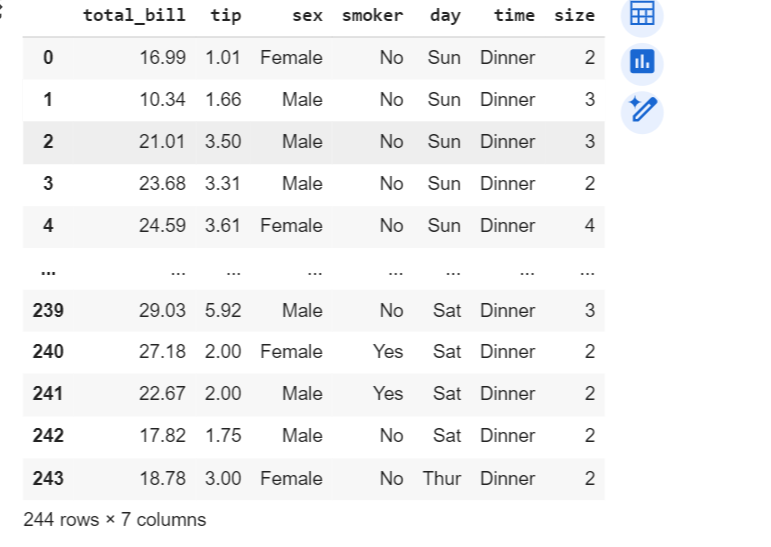

```
x=[1,2,3,4,5]
y1=[3,5,2,6,1]
y2=[1,6,4,3,8]
y3=[5,2,7,1,4]
sns.lineplot(x=x,y=y1)
sns.lineplot(x=x,y=y2)
sns.lineplot(x=x,y=y3)
plt.title("Multi-Line Plot")
plt.xlabel("X Label")
plt.ylabel("Y Label")
```
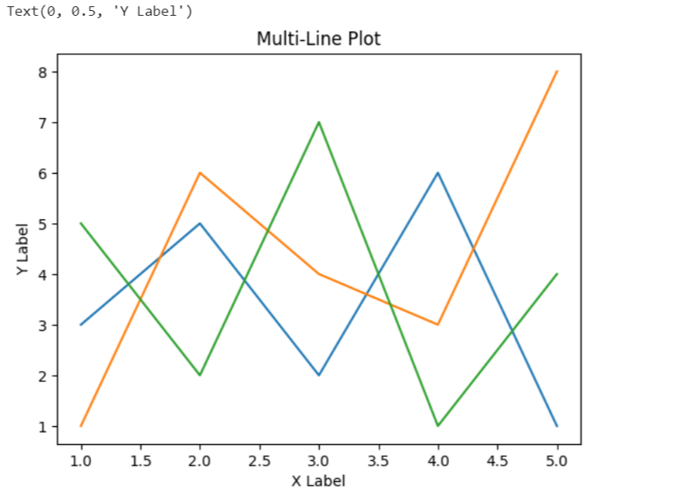

```
#calculate the avg for total bill and tip for each day
avgbill=df.groupby('day')['total_bill'].mean()
avgtip=df.groupby('day')['tip'].mean()
```
```
plt.figure(figsize=(8, 6))
p1 =plt.bar(avgbill.index,avgbill,label='Total Bill')
p2 =plt.bar(avgtip.index,avgtip, bottom=avgbill, label='Tip')
# Set the labels and title
plt.xlabel('Day of the week')
plt.ylabel('Amount')
plt.title('Average Total Bill and Tip by Day')
plt.legend()
```
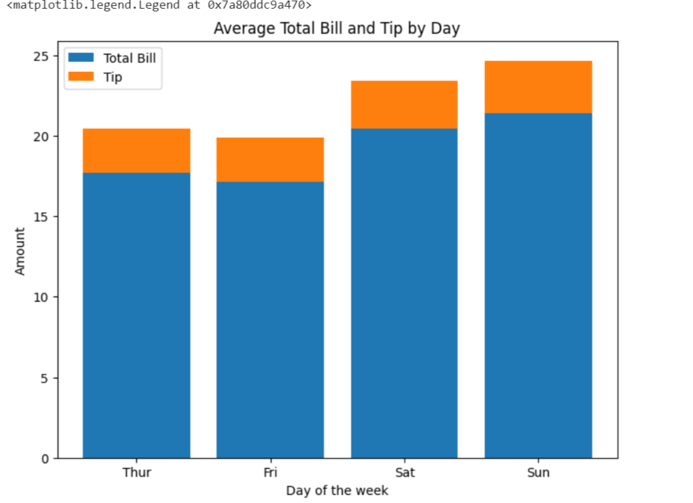
```
# Create a group bar chart
p1= plt.bar(avgbill.index, avgbill, label='Total Bill' ,width=0.4)
p2= plt.bar(avgtip.index, avgtip, bottom=avgbill, label='Tip',width=0.4)
plt.title('Average Total Bill and Tip by Time of Day')
plt.xlabel('Time of Day')
plt.ylabel('Amount')
plt.legend()
```
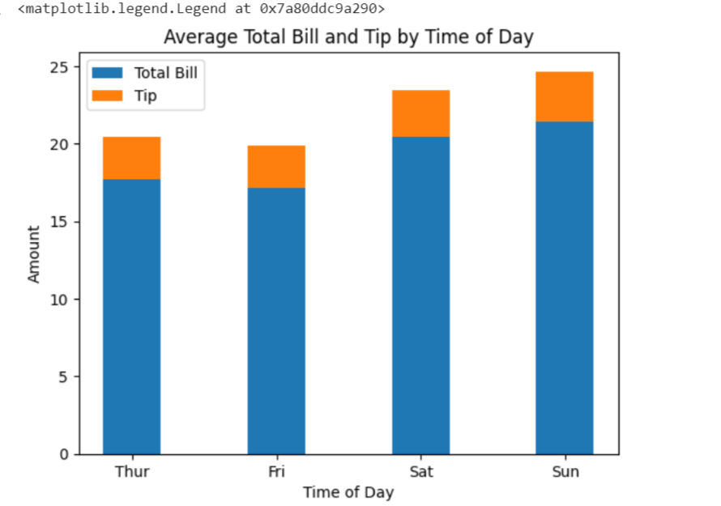

```
sns.barplot(x='day', y='total_bill',hue='sex', data=df, palette='Set3')
plt.xlabel('Day of the week')
plt.ylabel('Total Bill')
plt.title('Total bill by Day and Gender')
```


```
 sns.scatterplot(x='total_bill',y='tip',hue='sex',data=df)
  plt.xlabel('Total Bill')
  plt.ylabel('Tip Amount')
  plt.title('Scatter Plot of Total bill vs tip amount')
```
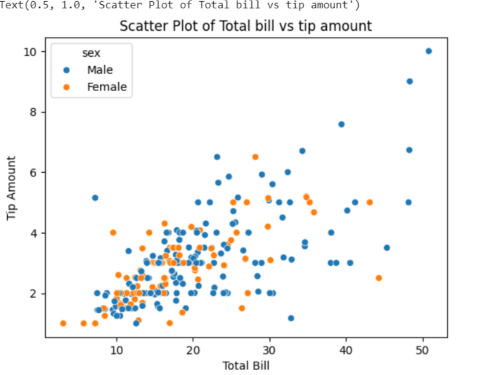

```
sns.boxplot(x=df['day'],y=df['total_bill'],hue=df['sex'])
```
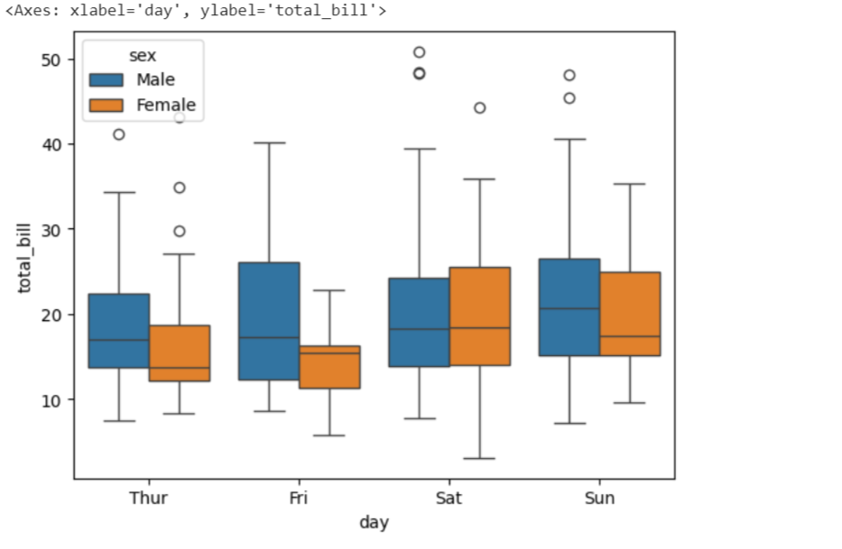

```
sns.boxplot(x="day", y="total_bill", hue='smoker', data=df, linewidth=2, width=0.6, boxprops={"facecolor":"lightblue","edgecolor":"darkblue"}, whiskerprops={"color":"black","linestyle":"--","linewidth":1.5}, capprops={"color":"black","linestyle":"--","linewidth":1.5})

```
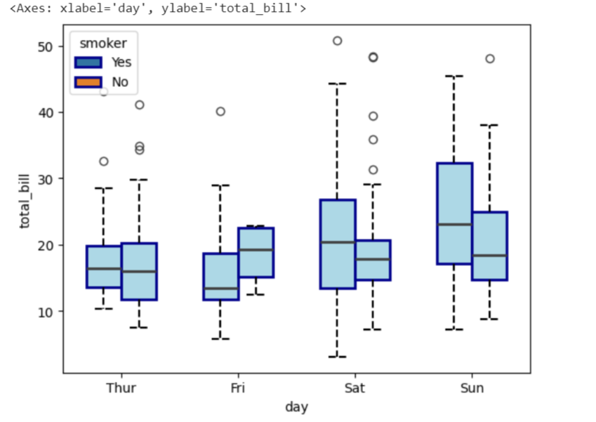

```
sns.violinplot(x="day", y="total_bill", hue="smoker", data=df, linewidth=2, width=0.6, palette="Set3", inner="quartile")
#Add labels and title
plt.xlabel("Day of the Week")
plt.ylabel("Total Bill")
plt.title("Violin Plot of Total Bill by Day and Smoker Status")
```
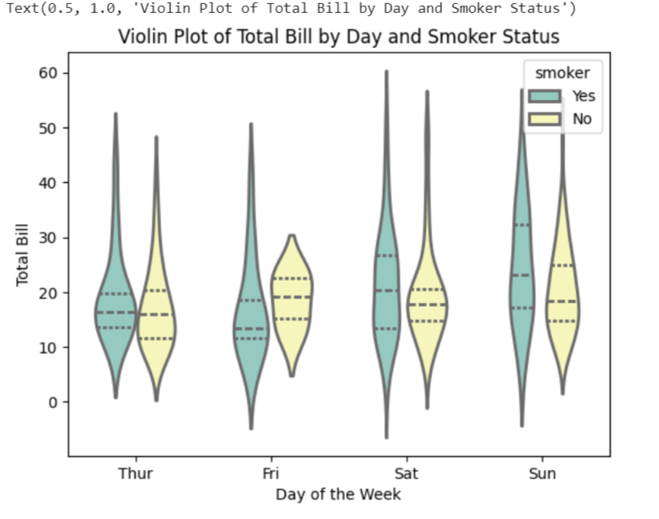

```
sns.set(style = 'whitegrid')
sns.violinplot(x ='day', y ='tip', data = df)
```
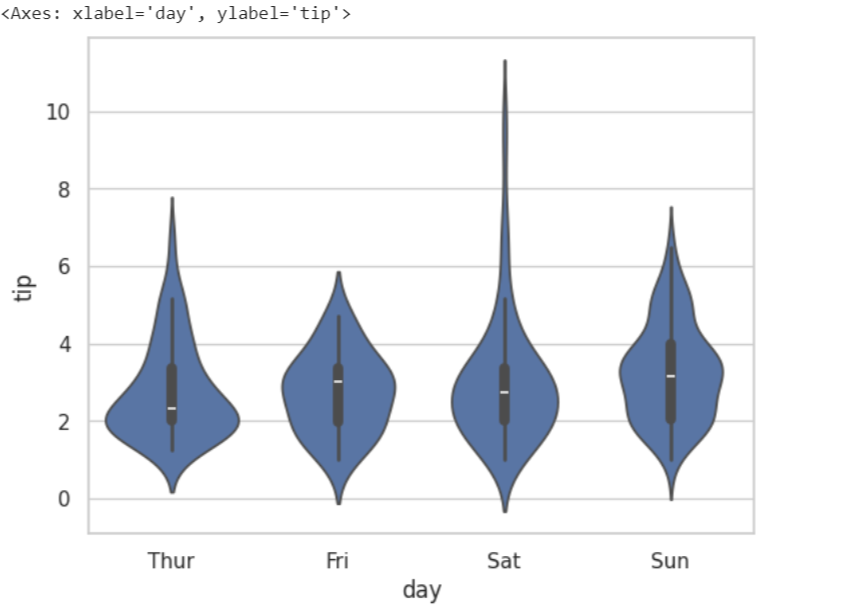

```
# use to set style of background of plot
sns.set(style="whitegrid")
# loading data-set
sns.violinplot(x="tip", y="day", data=df)
```
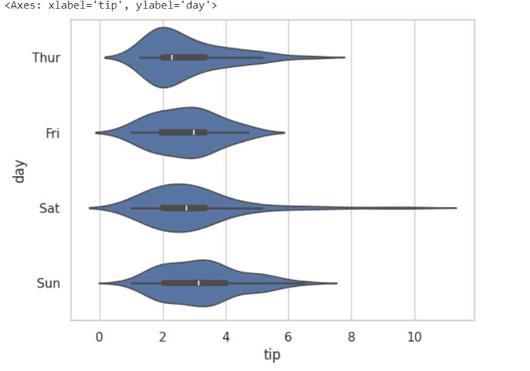

```
sns.kdeplot(data=df,x='total_bill',hue='time',multiple='fill',linewidth=3,palette='Set2',alpha=0.8)
```


```
sns.kdeplot(data=df,x='total_bill',hue='time',multiple='stack',linewidth=3,palette='Set2',alpha=0.8)
```
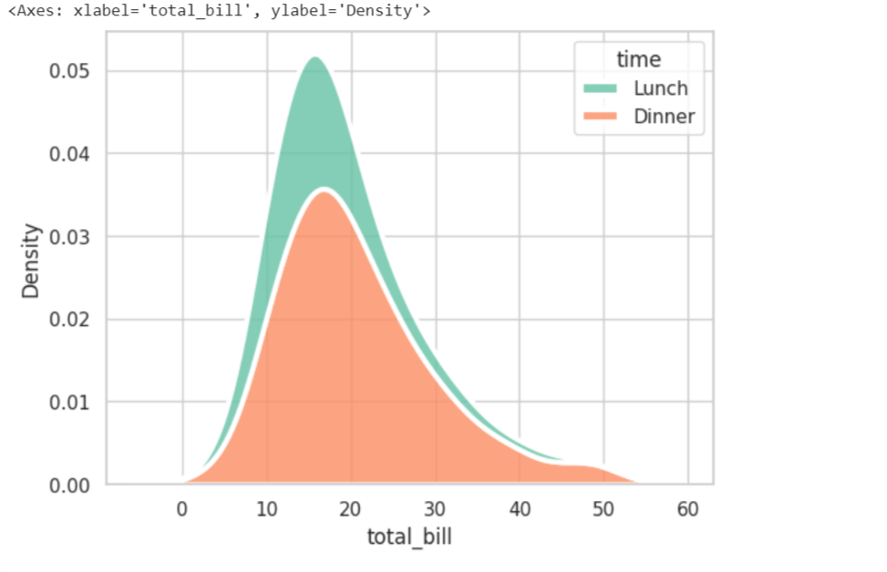

```
sns.kdeplot(data=df,x='total_bill',hue='time',multiple='layer',linewidth=3,palette='Set2',alpha=0.8)
```
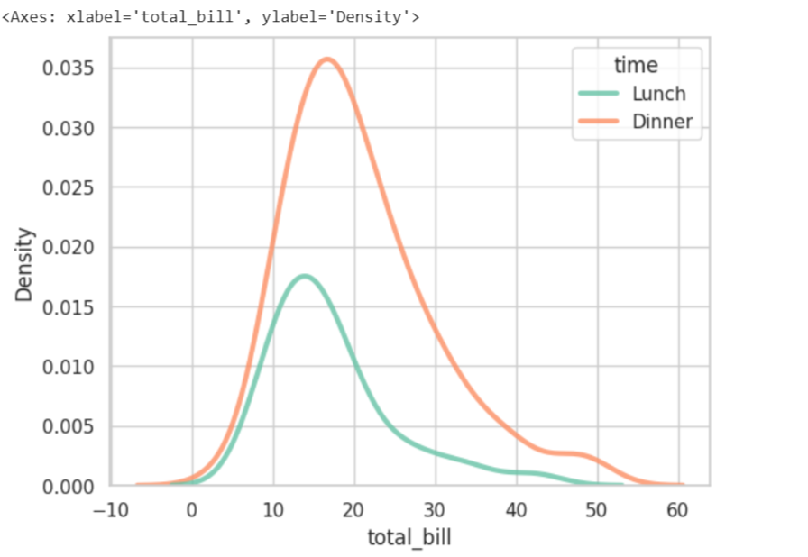
# Result:
  Successfully Perform Data Visualization using seaborn python library for the given datas